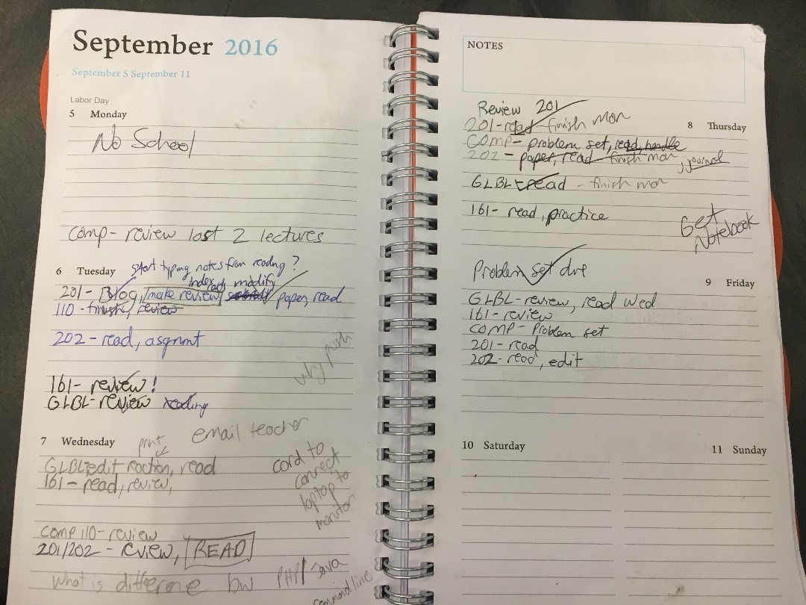
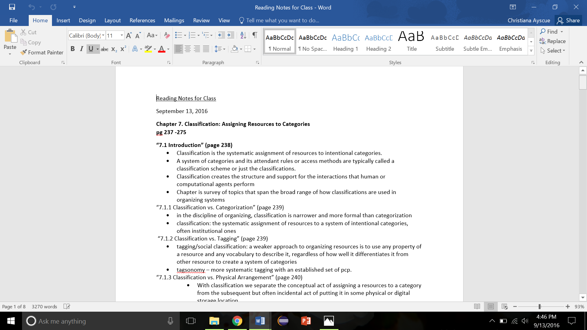
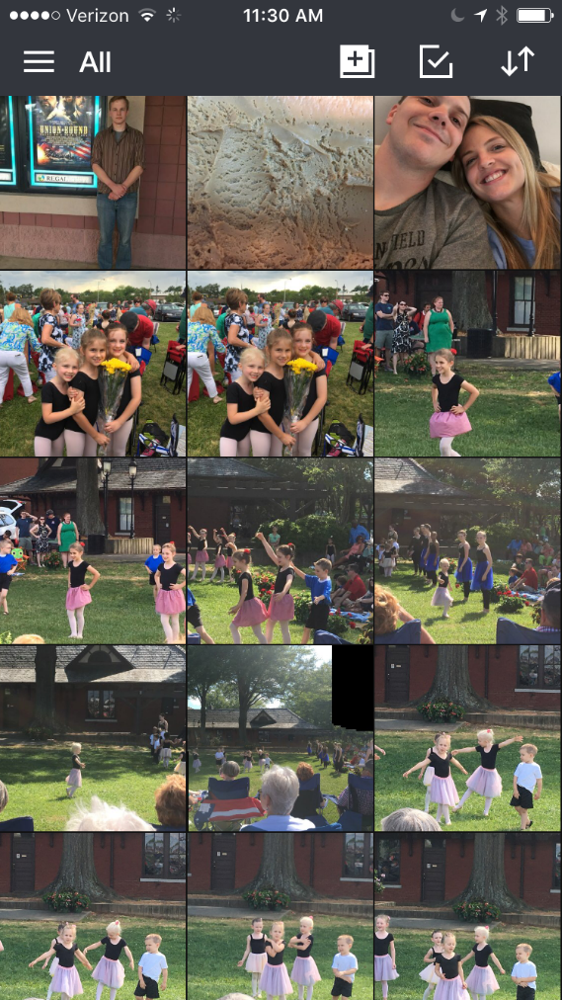

## Christiana Ayscue 

### INLS 201 – 001  

### September 1, 2016

***Tasks I perform as a student include…***

-   Read a wide variety of materials

-   Keep track of daily assignments

-   Communicate with other students, professors, and myself

-   Organize paperwork

-   Take notes before, during, and after class

-   Study for tests

-   Search for information

-   Write papers, create PowerPoints

***The kinds of information I use to perform each task and where the information is located…***

-   Textbooks, newspapers, PDF files, blog postings, emails, instructor
    authored documents. Some of these materials are accessed in hard
    copy format from a library or bookstore but the majority of
    materials are found and read on the computer

-   Assignments are tracked using a personal planner (hard copy).

-   Communication occurs via UNC email account and the Apps StudyRoom
    or GroupMe. This includes correspondence with others as well as
    emailing pertinent or interesting documents to myself.

-   Paperwork (although there is a minimal amount) is organized in
    folders that I have assigned to specific classes.

-   Notes are taken either on the computer in a Word document or by hand
    in a notebook depending on the subject material and
    class environment. Occasional documents are saved on OneDrive.

-   Studying occurs through accessing and reviewing electronic or hard
    copy notes, PowerPoints, and other reading materials. Occasional
    documents are saved on OneDrive.

-   Searching for information in hard copy books takes place in a
    library or bookstore while online searches happen anywhere I have
    access to one of my devices.

-   Papers and PowerPoints are written/created on my computer using the
    appropriate programs and can utilize any number of reading materials
    or notes. Occasional documents are saved on OneDrive.

    ***How items are organized in my workspace… ***

-   The majority of the reading materials I access are already organized
    for me on a class website or in Sakai by class session and date. I
    choose to download some of these online materials and put them into
    a designated course folder that I’ve created on my personal laptop.
    Hard copy materials are kept in my dorm room or go home with me on
    weekends because I do not need to bring them to class.

-   My planner is always present in my book bag and goes with
    me everywhere. The information in the planner is organized by class
    and date.

-   Emails and messages within Apps are organized by date (this is how
    the programs automatically organize). I have “clutter” and “junk”
    folders where emails of an advertising nature are
    automatically directed.

-   I carry the appropriate physical folders with me to class and leave
    the others in my dorm room, rotating them as necessary.

 
 
-   Each notebook is assigned
    to a specific class and goes with me to that particular class. Notes
    taken on the computer are put into the appropriate course folder.
    Dates and titles are included with hard copy or electronic notes.

-   Study materials are placed in appropriate course folders (physical
    or electronic)

-   Items searched for are kept track of by the browser history unless I
    need to frequently access that info. If that is the case, I bookmark
    the page on my browser. I currently have no hard copy materials in
    my workspace as a result of academic searches.

-   Any documents created on my computer will, once again, be placed in
    the appropriate course folder. Within all of these course folders,
    files are sorted by file type.

-   Any notes, writings, study guides, or project saved on my OneDrive
    are not organized in any particular order. They merely exist to
    ensure an extra copy of a file is available.

***If you were to perform the same task for your email, your digital photos, your digital music, and other items of personal interest, what differences would you find in task, information type, and structure?***

-   **Email:** My personal email accounts don’t look that different from
    my school account. The personal account that I use on a daily basis
    is also a Gmail account. The primary difference between my UNC and
    personal accounts is the actual email program (Gmail
    versus Outlook). In my personal account, emails are organized by
    date and there is a separate folder where advertisements are
    automatically sent so I do not constantly get alerted by junk.
    Overall, there really isn’t any organizing going in my
    personal account. I don’t delete anything except junk so I can
    simply search and access information or emails that I may need in
    the future. Because of this practice I would say that I use my email
    account not only for communication but for extensive storage and a
    way to keep an easily accessible timeline of events and information.

-   **Digital Photos:** I have managed to
    consolidate my plethora of digital photos into one primary location:
    **Amazon Photo**. With Amazon Prime I have unlimited photo storage
    which has enabled me to add all of my old digital photos (going back
    to 2007) and continually add all of the photos I take on my IPhone.
    The app on my phone is actually set up to automatically photos as I
    take them so I have to do very little to keep this transfer of
    information going. The app also organizes all of my pictures by
    date, separating them into separate months for me. When my IPhone
    gets upset with me for taking up too much room in storage I can
    simply delete them knowing that a copy is automatically saved in
    Amazon Photo.
                        
**Digital Music:** This is where my lack of organization really becomes
apparent. I utilize a variety of programs to listen to music such as
ITunes, Spotify, Amazon Prime, Sound Cloud, and Pandora. Within ITunes
and Amazon Prime I have actual MP3s while I only stream with the other
programs. I had put substantial effort in past years to create libraries
and playlists, but I have essentially given up on that task. Because
streaming online is so quick and easy that has become my go-to option
when listening to music. There are pre-made playlists already in
existence on Spotify and other programs which enable me to just hit play
and go about my business. Music is important to me but because of the
internet I feel no need to spend much time organizing or labeling.

-   **Calendar:** This is the one “non-academic” area of my life where I
    put forth real effort to be organized. I use the calendar on my
    IPhone to keep track of all appointments, events, or just little
    things I need to be reminded of later in the day. I constantly
    update and check my daily schedule to ensure nothing is forgotten. I
    make occasional hard copy lists and notes on scrap pieces of paper
    but usually transfer those into my phone “just in case”.

    **Overall…**it has become obvious to me as I have created this
    report that I am much more concerned with physical notes and
    schedules in my academic life as opposed to my personal life. There
    is something about an actual piece of paper that is so refreshing in
    this digital world and a part of me feels that if I actually write
    something down it will stick with me. At the same time, being able
    to carry most of my reading material, notes, correspondence, photos,
    and music around in a light weight device is also quite a luxury
    (and easier on my back). Although the occasional vinyl or framed
    photo is quite nice, I have no desire to tote around photo albums or
    collections of CDs everywhere I go!

***How much does UNC and/or SILS influence the way you organize your digital information?***

Although I have only been attending classes here for a month, the
methods I am using for managing and organizing my information are
gradually evolving. The academic environment here demands more of me
which means more attention must be shown to the quality of my notes and
how they are organized for easy retrieval. My collection of in-class and
out of class notes is growing at a rapid rate and I have to constantly
create new files. It is extremely important that I save them in the
right place and that I create informative and concise file names.

I have not taken advantage of this yet, but soon I would like to tap
into the digital library storage that I have access to as an Information
Science major. As I go through my current classes I am noting articles
or books that I have found useful and would like to store for the years
to come. The first book I plan to add is Robert J. Glushko’s, *The
Discipline of Organizing.*

**Would someone else be able to use your structure easily?**

I believe the structure of my academic materials is relatively
self-explanatory. What I mean is, everything stored in a logical manner
(at least it’s logical as far as I am concerned). There is a folder for
each of my courses and all are quickly found within the document folder
of my laptop. I keep the folders and notebooks I need with me and keep
the others collected together in my dorm room so they are easy to find
and rotate. I am not artistic nor creative so my organizational skills
remain on the simple side, yet I do believe my methods are easy to
maneuver and navigate. The goal of an organizing system is to facilitate
interactions and that has been accomplished within my structure.

I do not think that anyone other than myself would be too fond of how I
store and organize digital music resources (or don’t). That is something
that will only make sense or be useful to myself alone.

**What percentage of the stuff in your physical space (desk, apartment,
etc.) **

**and your digital space (laptop, home directory on the network, Google
space, etc.) **

**is school-related?**

At this point in the semester I can easily assert that the majority of
time spent on my laptop, the hours of internet/data usage, and the items
saved on my OneDrive are 98% school-related. When I have time here or
there to defrag I may spend some time using the internet in a leisurely
fashion but that is not a common occurrence in life at this point.

I could make a stretch and say that everything in my dorm room is
school-related because it is only in my dorm room to enable me to live
on campus and attend college. In actuality, I have a desk both at my
dorm room and at home in my apartment for studying purposes in addition
to storage areas and supplies. Because I do have an apartment and a dorm
room, the amount of space used for school-related materials is probably
only about 10%, but the majority of my time in my dorm or apartment is
spent using that 10%.

**What do you like best about your organizational structure and what do
you find most challenging?**

Ironically, what I like best about my organizational structure and what
I find most challenging go hand in hand. I believe the best part of my
system to be the notebooks that contain handwritten notes and a hard
copy planner to keep track of assignments. I am very particular in
keeping up with which notebooks need to go with me where, and that
planner is never far from hand. Visualizing my handwritten notes is a
great help when test time comes.

At the same time, my handwriting is atrocious. I often find the notes
themselves to be messy or disorganized. I grew up taking rigorous notes
in church that followed a stringent outline every Sunday, and when I
don’t have strict outline to follow my notes end up all over the place.
Despite the sometimes haphazard state of my handwritten notes, I still
believe it is worth making the effort to do so whenever possible. Some
may call my methods outdated but I come from a family of writers where
pen and paper will always have their value.

|    Class                       |         Day                    |      Time      |
|  ----------                    |     :-------------:            |    ------:     |
| Global Studies                        M/W/F           | 10:10-11:00a.m.|
| Tools for Information Literacy |    M/W               | 3:35-4:50 p.m.  |
| Foundations of Inf. Science                    | T/Th                 |    $1 |
| Intro to Programming
| F